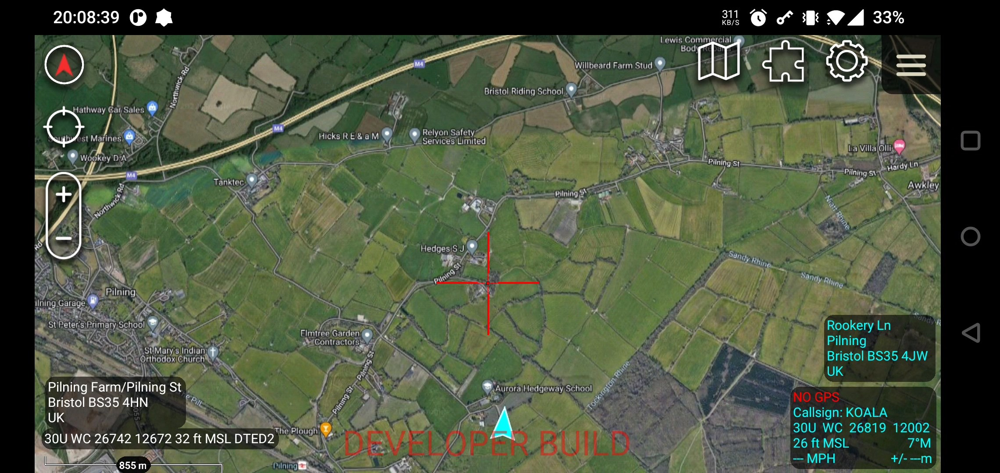
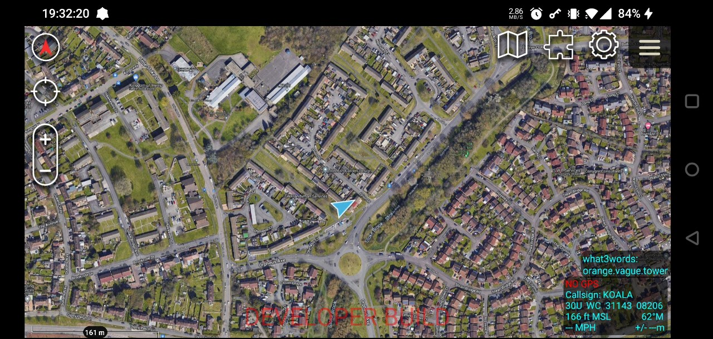
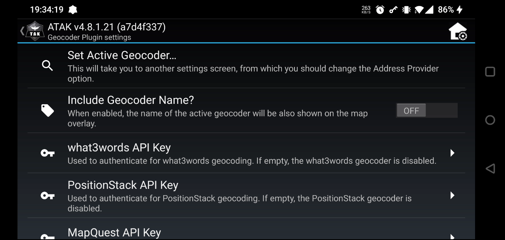

# TAK Geocoder Plugin


## Summary
A small plugin for the [ATAK](https://github.com/deptofdefense/AndroidTacticalAssaultKit-CIV) Android application, which allows you to see a human-readable address in the bottom-right of the screen - just above the standard coordinate widget.

Supports geocoding from any built-in Geocoders:
- [Android Native Geocoder](https://developer.android.com/reference/android/location/Geocoder)

But also adds custom geocoders, each of which pulls data from public APIs using authenticated API tokens:
- [what3words](https://what3words.com/)
- [PositionStack](https://positionstack.com/)
- [MapQuest](https://developer.mapquest.com/documentation/geocoding-api/)

As a bonus, if you have the "Designate the Map Center" setting enabled in ATAK (found under "Settings", then "Basic Display Settings"), the coordinates of the point under the screen's center point (shown as a red cross in the screenshot below) will also be geocoded and displayed in the bottom left of the screen.

Check the [latest release page](https://github.com/jonapoul/tak-geocoder-plugin/releases/latest) to find a ready-to-install APK for ATAK 4.8.1. Let me know if you're looking for any other specific versions.

## Screenshots



| Using What3Words & Geocoder Name | Settings |
|:--:|:--:|
|  |  |

## Build Steps
1. Clone the repository:
    ```sh
    git clone https://github.com/jonapoul/tak-geocoder-plugin.git
    ```
1. Create a keystore file named `keystore.jks`, then place it in the root of the project's directory. Note down the passwords and aliases that you use to generate it.
1. Create a `local.properties` file in the root of the project, then enter the aforementioned properties:
    ```properties
    takDebugKeyFile=keystore.jks
    takDebugKeyFilePassword=...
    takDebugKeyAlias=...
    takDebugKeyPassword=...
    takReleaseKeyFile=keystore.jks
    takReleaseKeyFilePassword=...
    takReleaseKeyAlias=...
    takReleaseKeyPassword=...
    ```
1. Create a directory one level above this repo called `maven`, then lay it out like below:
    ```
    tak-geocoder-plugin/
    ├─ ...
    maven/
    ├─ com/
    │  ├─ atakmap/
    │  │  ├─ sdk/
    │  │  │  ├─ 4.8.1.21/
    │  │  │  │  ├─ sdk-4.8.21.jar
    │  │  │  │  ├─ sdk-4.8.21.pom
    │  │  │  │  ├─ sdk-4.8.21-javadoc.jar
    ```
    This contains the ATAK SDK library for use in this project. The POM file looks like:
    ```xml
    <project xmlns="http://maven.apache.org/POM/4.0.0" xmlns:xsi="http://www.w3.org/2001/XMLSchema-instance" xsi:schemaLocation="http://maven.apache.org/POM/4.0.0 http://maven.apache.org/xsd/maven-4.0.0.xsd">
        <modelVersion>4.0.0</modelVersion>
        <groupId>com.atakmap</groupId>
        <artifactId>sdk</artifactId>
        <version>4.8.1.21</version>
        <packaging>jar</packaging>
    </project>
    ```
1. Install a debug/developer version of ATAK matching the version of the plugin. This will have a red overlay at the bottom of the map to tell you that it's a debug build.
1. Connect your phone to your PC with USB debugging enabled.
1. Open this project in a terminal and run:
    ```bash
    ./gradlew app:installCivDebug
    ```

## Optional Geocoders

This plugin comes with optional geocoding functionality for:
- what3words
- PositionStack
- MapQuest

These services all have API usage limits, which is why I'm not distributing the APK fully-built with all features :)

If you want to enable any of these, you'll need an API key for the respective service and an internet connection on your device.

### Compile-time Configuration
Open/create the file `local.properties` in the root of the project, and add properties like in the snippet below:

```properties
# Register for a key here: https://what3words.com/select-plan?referrer=/public-api
W3W_API_KEY=your-api-key-here

# Register for a key here: https://positionstack.com/signup
POSITIONSTACK_API_KEY=your-api-key-here

# Register for a key here: https://developer.mapquest.com/user/login/sign-up
MAPQUEST_API_KEY=your-api-key-here
```

If any of these keys are missing from the file, that geocoder will not be registered in ATAK so you won't be able to select it. Make sure the property value exactly matches that given by the respective service on their account page, then build the project's APK with:

```shell
./gradlew app:assembleCivDebug
```

### Runtime Configuration
Open the plugin settings by tapping the geocoder overlay in the bottom right, then select the relevant "API key" option in the settings page. Paste/type your key in, click OK and then select that geocoder.

If you'd like to semi-automate this step to avoid the (understandable) faff of typing/copypasting, follow the standard ATAK process for loading preferences from a `.pref` file and add the following keys to the file:
```xml
<?xml version='1.0' standalone='yes'?>
<preferences>
    ...
    <preference version="1" name="com.atakmap.app.civ_preferences">
        ...
        <entry key="GEOCODER_w3wApiKey" class="class java.lang.String">YOUR_API_KEY</entry>
        <entry key="GEOCODER_mapQuestApiKey" class="class java.lang.String">YOUR_API_KEY</entry>
        <entry key="GEOCODER_positionStackApiKey" class="class java.lang.String">YOUR_API_KEY</entry>
    </preference>
</preferences>
```
Then import this preference file into ATAK in the normal way.

## Known Issues

- At the moment, the plugin will auto-refresh the geocoded address every three seconds, regardless of whether the value has changed or not. So if you're using one of the custom geocoders with limited APIs and have auto-billing set up on your account, be careful!
- If you attempt to reverse-geocode from the Coordinate Entry dialog with any of the custom geocoders, nothing will happen because they haven't been set up to do reverse geocoding (yet?)

## TODO
- configurable refresh period
- add caching to avoid wasting API calls?
- make HTTPS configurable for PositionStack
    - optional feature for paid accounts, the basic plan just uses insecure HTTP
- include some way of showing API quota? Don't think most of these services support
querying it, but who knows
